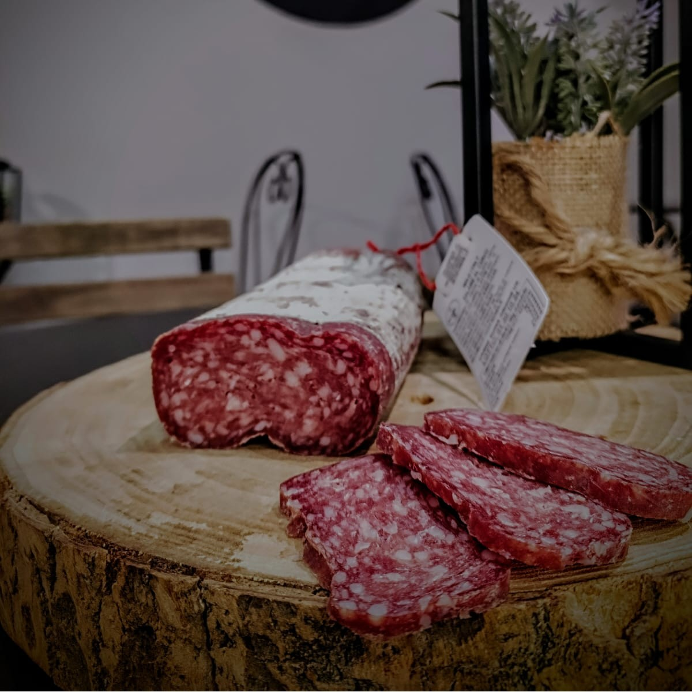

# Wild Italy

Codice di Emanuele Parmegiani.

Implementazione del documento di design `Wild Italy.dc.html` (progetto Claude Design
`5d883d42-fdf6-4457-9e95-25598407a515`), sulla **direzione 1a — bottega calda**
(legno, vinaccia, ottone), con il mobile del **turno 2** (schermate 2a / 2b).

Sito statico, senza build e senza dipendenze: si apre con qualsiasi server statico.

```bash
npx serve .        # oppure: python -m http.server
```

## Pagine

| File | Schermata del mockup |
|---|---|
| `index.html` | 1a (desktop) + 2a (mobile) — homepage |
| `categoria.html?c=<slug>` | 1c — categoria, template per tutti gli scaffali |
| `prodotto.html?p=<slug>` | 1d (desktop) + 2b (mobile) — scheda prodotto |
| `box.html` | 1e — box e degustazioni |
| `selezione.html?s=<slug>` | non nel mockup — `guida` (fatti guidare), `regalo` (idee regalo), `sotto-20`; dati in `selezioni` di `catalogo.js` |
| `guida.html` | "Fatti guidare": la visita guidata, versione b di `design/Fatti guidare.dc.html` (progetto `f2739665-509a-4897-a51c-9b998182b4b4`), 1b desktop + 2b mobile; tappe in `visita` di `catalogo.js`, il cesto è il carrello |
| `info.html` | spedizioni / conservazione / resi / contatti |
| `catalogo.html` | "Catalogo completo": tutti i prodotti in un listino per categoria, con ricerca e filtri «senza latte» / «senza solfiti» (dagli allergeni in etichetta; le box non passano mai). Vista "listino" di `design/Catalogo completo.dc.html` (progetto `2b827df0-7514-4854-ac07-1450b157bbff`); vetrina e colonne non implementate. Voce "Catalogo" nella navigazione, subito dopo Dispensa, e link nel footer |

`1b` (direzione editoriale) e `1f`/`1g` (mobile del turno 1) non sono implementate:
la prima è la direzione non scelta, le seconde sono superate da 2a/2b.

## Struttura

```
assets/css/wild.css     sistema di design (token, componenti, breakpoint)
assets/js/catalogo.js   dati: categorie, prodotti, box, dati della bottega
assets/js/wild.js       chrome condiviso + comportamenti
assets/img/definitive/  foto nuove del cliente, quelle che restano
assets/img/provvisorie/ foto vecchie e segnaposto (telefono, web), da sostituire
assets/img/             solo logo e favicon
design/                 copia del documento di design di partenza
```

Un prodotto è a posto con le foto quando ne ha tre in `definitive/`: confezione di fronte,
confezione di retro (etichetta), e confezione di fronte con accanto il piatto già cucinato.
In galleria vanno in quest'ordine: fronte, piatto, retro.

`wild.js` costruisce da solo header, footer, menu, carrello, ricerca, barra di
navigazione mobile e il pulsante WhatsApp fisso in basso a destra (numero da `bottega.telHref`
in `catalogo.js`): le pagine contengono solo `<main>`. Ne consegue che per
aggiungere una pagina bastano lo scheletro HTML, `data-pagina="..."` sul `<body>`
e i due `<script>` in fondo.

## Breakpoint

- `< 1120px` — layout mobile/tablet: menu a scomparsa, ricerca dalla lente nell'header,
  barra di navigazione fissa in basso (4 voci: Bottega, Guida, Cerca, Carrello; tap target 48–56 px).
  Account resta solo nell'header finché non è collegato.
- `>= 1120px` — layout desktop: navigazione orizzontale, griglie a 3–4 colonne. Fra 1120 e 1279 px
  i margini scendono a 48 px e Cerca/Account restano solo icona, se no le 8 voci non stanno su una riga.

Sulla scheda prodotto sotto i 1120 px l'intestazione diventa contestuale
(indietro · nome · condividi · carrello) e compare la barra di acquisto fissa,
come nella schermata 2b.

## Foto

Ogni slot foto è un elemento `.ph`: senza foto mostra la didascalia del mockup
(cosa deve andarci), con la foto la didascalia sparisce.

- **Pagine statiche**: basta inserire un `` dentro lo slot, il CSS lo fa combaciare:

  ```html
  <div class="ph"></div>
  ```

- **Catalogo** (`catalogo.js`): `img` è la foto di card, carrello, ricerca e abbinamenti;
  `galleriaImg` è la galleria della scheda prodotto; senza `galleriaImg` la galleria usa la sola `img`,
  e senza foto vere mostra un solo segnaposto (la didascalia `foto`). Contatore, frecce, pallini e
  miniature compaiono solo con più di una foto. Le didascalie di `galleria` restano nel catalogo
  come elenco delle foto da fare. Il testo
  alternativo nasce dalla didascalia `foto`; per le categorie `imgAlt` la sostituisce quando la
  foto non corrisponde alla didascalia.

Foto vere in uso (dal vecchio sito Wix e dalla cartella `foto/`, copie web max 1600 px in `assets/img/`):
hero e "chi siamo" della home, tutti i prodotti tranne Sagrantino e box, tutte le categorie tranne vini.
Restano segnaposto: vetrina in via Porta Fuga, Sagrantino, tutti i box, categoria vini.
Pronte ma non usate: `home-*` (vecchia home) e `blog-*` (articoli sul tartufo).

Favicon: `assets/img/favicon.svg` è il marchio (esagono con le montagne) ridisegnato da
`particolare_logo.jpeg`; `favicon-32.png` e `apple-touch-icon.png` sono ricavati dall'SVG e vanno
rigenerati se cambia. Il logo completo è `logo.jpeg`: sta nel footer, in "La nostra storia" e
nell'anteprima dei link (`og:image` in ogni `<head>`, con l'indirizzo assoluto dell'anteprima
GitHub Pages: va cambiato quando il sito passa al dominio definitivo).

Gli originali recuperati dal vecchio sito (35 foto) sono in `sito vecchio/foto_recuperate/`,
i dati dei prodotti (prezzi, ingredienti, valori nutrizionali) in `sito vecchio/prodotti_sito_vecchio.md`.

## Configurazione

Le due props del documento di design sono esposte come config globale. Dichiararla
**prima** di `wild.js`:

```html
<script>window.WILD_CONFIG = { mostraBarraAnnuncio: true, mostraBadgeArtigianale: false };</script>
```

Il badge "artigianale" è spento di default: i salumi li produce uno stabilimento autorizzato per conto
di Wild Italy, e la dicitura va confermata con la bottega prima di riaccenderlo.

## Dati prodotto e obblighi di legge

Le schede riportano i dati dell'etichetta, come chiede la vendita online di alimenti (Reg. UE 1169/2011,
art. 14):
- nome come in etichetta, con `denominazione` quando quella piena è più lunga;
- ingredienti con allergeni in maiuscolo, quantità netta (`peso`), conservazione, operatore responsabile
  (`produttore`), valori nutrizionali;
- prezzo al kg o al litro, calcolato da `grammi`/`ml`.

Fonti: le foto `-2` delle etichette e `sito vecchio/prodotti_sito_vecchio.md`. Niente frasi che l'etichetta
non conferma: provenienze, "artigianale", "affumicato", "magro", anno di fondazione. Niente prezzi barrati
inventati. Eccezione: le descrizioni dei prodotti (`descrizione`) le scrive Diego a mano e non si toccano,
nemmeno per queste parole.

Sulla spedizione la bottega ha confermato due cose: i prodotti partono **sottovuoto** e la
consegna avviene normalmente in **circa 48 ore**. Corriere refrigerato, imballo isotermico e
orari di partenza degli ordini erano inventati dal mockup: tolti da tutte le pagine.

## Carrello

Client-side, salvato in `localStorage` (`wilditaly:carrello`). Gestisce quantità,
formati e totale. Il pulsante "Vai alla cassa" non è collegato: serve un backend.

La spedizione è una cifra fissa per ordine, `bottega.spedizione` in `catalogo.js` (oggi 15 €,
quello che paga la bottega al corriere): il totale del carrello la comprende e `info.html` la
mostra da lì. Quanto far pagare al cliente è ancora da decidere: si cambia solo quel numero.

## Cosa manca / da decidere con la bottega

Segnalato nel codice e in pagina con il riquadro `DA DEFINIRE`, nella stessa
convenzione usata dal mockup per le foto:

- **Tutti i prodotti** hanno prezzi, pesi, ingredienti e valori del vecchio sito e delle etichette:
  da riconfermare con la bottega prima di andare online.
- **Oli al tartufo**: 100 ml come sulla bottiglia in foto; una riga della pagina vecchia dice 60 ml.
- **Salame al cinghiale e tartufo**: denominazione in etichetta illeggibile nella foto.
- **Orari** del negozio (sono quelli del mockup), costo definitivo della spedizione per il cliente
  (per ora 15 €) e soglia di spedizione gratuita, testo legale su resi e recesso,
  privacy e cookie.
- `vini` ha il solo Sagrantino citato nella 2b.
- **Box Regalo Oro**: nel mockup è una scheda in grigio senza prezzo, qui è marcato
  "in arrivo".
- Account, cassa e versione EN non sono collegati. Instagram e Facebook puntano alle pagine
  indicate nel vecchio sito.
